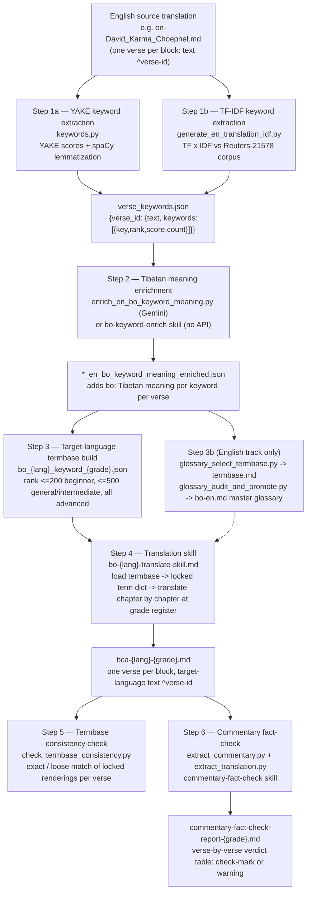

# BCA Translation Pipeline — Keyword → Termbase → Translation → Fact-Check

This documents the actual pipeline used in this vault, based on the scripts and skills in
`4-SYSTEM/`, illustrated with real examples from the Vietnamese and Hindi translation runs.

## Diagram



---

## Step 1 — Extract English keywords

Two interchangeable extractors exist, both consuming the graded/rough English translation
markdown (parsed verse-by-verse via the `^verse-id` block markers) and producing the same
downstream shape.

**1a. YAKE (`4-SYSTEM/scripts/english_keyword/keywords.py`)**
Uses the YAKE algorithm (unigrams–trigrams) then spaCy lemmatization + stop-word filtering.

```python
extractor = KeywordExtractor(score_threshold=0.3)
keywords = extractor.extract(source_text)          # YAKE score, lower = more important
extractor.save_verse_keywords_json(keywords, source_path, "output/en-...-keyword_verses_yake.json")
```

**1b. TF-IDF vs Reuters-21578 (`4-SYSTEM/scripts/english_keyword/generate_en_translation_idf.py`)**
Scores each word by term-frequency in the BCA text × inverse-document-frequency in a
10,788-document newswire corpus (`idf_corpus.py`) — words common in the BCA but rare in
everyday English score highest.

Example output shape (`en-David_Karma_Choephel_verse_keywords.json`), shared by both methods:

```json
{
  "6-22": {
    "text": "We don't get angry at bile and the like, even though they cause great suffering...",
    "keywords": [
      { "key": "angry", "rank": 1, "score": 97141.66, "count": 1 }
    ]
  }
}
```

## Step 2 — Enrich keywords with their Tibetan meaning

`enrich_en_bo_keyword_meaning.py` walks the verse-keyword JSON alongside the Tibetan root
text (`1-SOURCES/Translations/bo-བློ་ལྡན་ཤེས་རབ།.md`) and asks Gemini, verse by verse, for
the Tibetan word/phrase behind each English keyword *in that verse's specific context*
(not a dictionary lookup — the same English keyword can map to different Tibetan lemmas in
different verses). The `bo-keyword-enrich` skill does the same job without an API call, for
cases where the mapping can be done directly.

```json
{ "key": "angry", "rank": 1, "score": 97141.66, "count": 1, "bo": "ཁྲོ་" }
```

## Step 3 — Build the target-language termbase (per language, per grade)

The enriched JSON is filtered by keyword rank and given a translation in the target
language, producing one file per grade: `bo_hi_keyword_beginner.json`,
`bo_vi_keyword_advanced.json`, etc. Rank cutoffs control how much vocabulary the grade
exposes: beginner keeps only rank ≤ 200 (core terms only), general/intermediate keep
rank ≤ 500, advanced keeps everything.

```json
{
  "1-1": {
    "text": "I bow down to the sugatas...",
    "bo_text": "བདེ་གཤེགས་ཆོས་ཀྱི་སྐུ་མངའ་སྲས་བཅས་དང༌། ...",
    "hi_text": "मैं सुगतों को...",
    "keywords": [
      { "key": "sugatas", "rank": 3, "bo": "བདེ་གཤེགས་", "hi": "सुगत", "grade": "beginner" }
    ]
  }
}
```

A parallel, English-only branch of this same step exists for the English scholarly/general/
beginner tracks: `glossary_select_termbase.py` formalizes each track's `termbase.md` from the
attested renderings in the master glossary `2-RAILS/Bilingual-Glossaries/bo-en.md`, and
`glossary_audit_and_promote.py` finds terms used in a track but missing from that master
glossary and promotes them into it — keeping the three English registers and the master
glossary from drifting apart.

## Step 4 — Translate, chapter by chapter, using the skill

`bo-hi-translate-skill.md` / `bo-vi-translate-skill.md` (identical structure per language):

1. Load the grade's termbase JSON, build a flat `english_key -> target_language` dict
   (first occurrence wins) — these renderings are **locked** for the whole document.
2. Group verses by chapter (`0, I, 1–10, colophon`).
3. Translate each chapter's verses from the English `text` field, substituting locked terms
   and writing in the grade's register (e.g. beginner Hindi glosses Sanskrit on first use:
   `बोधिचित्त (सबके भले की इच्छा)`; advanced keeps Sanskrit bare or expands it further).
4. Self-check: re-scan the whole output for any verse where a locked term drifted to a
   synonym, and fix it.
5. Write `3-TRANSFORMATIONS/Translations/{lang}-{grade}/bca-{lang}-{grade}.md` — one
   `{translated text} ^{verse-id}` block per verse, headings as `## text ^{id}` where the ID
   ends in `-0`.

Example output line (`bca-hi-beginner.md`):

```
मैं सुगतों (यानी बुद्धों) को, जिनके पास धर्मकाय है, और उनकी संतान — बोधिसत्वों — को आदर से प्रणाम करता हूँ। ^1-1
```

## Step 5 — Mechanical termbase-consistency check

`4-SYSTEM/scripts/termbase-consistency-check/check_termbase_consistency.py` catches
vocabulary drift a human proofreader would otherwise have to eyeball across 900+ verses:
for every verse, it looks up which lemmas the verse rail (`2-RAILS/Verses/<id>.md`) marks
as load-bearing, checks each has an entry in that track's `termbase.md`, then searches the
verse's actual translated text for the *locked* rendering (exact match, or a loose
article/plural-insensitive match).

```
verse    bo term                      expected (fr)                    result
1-1      byang chub sems              bodhicitta (l'esprit d'eveil)    OK
1-9      lha ma yin                   demi-dieu                        MISSING
```

This script currently targets the French/English rail-based tracks; for the Hindi/
Vietnamese grades, the equivalent check is the manual Step 4 consistency pass described
above (no rail files exist yet for those languages).

## Step 6 — Fact-check against Khenpo Zhenga's commentary

The `commentary-fact-check` skill is the accuracy backstop: it doesn't check wording, it
checks whether the translation actually says what the commentary says the verse means.

```bash
python3 4-SYSTEM/Skills/commentary-fact-check/scripts/extract_commentary.py \
    1-SOURCES/Commentaries/Transcluded/BCAC19_KS_bo.md --json /tmp/ks_commentary.json
# splits the commentary's 910 transclusion markers into {verse_id: Tibetan prose}

python3 4-SYSTEM/Skills/commentary-fact-check/scripts/extract_translation.py \
    3-TRANSFORMATIONS/Translations/hi-beginner/bca-hi-beginner.md \
    --chapter 1 --json /tmp/hi_ch1.json
# parses the graded translation into {verse_id: translated text}
```

For each verse in scope, the commentary passage and the translated line are read side by
side; the verse gets ✓ if the commentary's content (similes, named entities, enumerations)
is faithfully present, or ⚠ with a concrete note if something is missing or contradicted.
Verdicts are appended to a running report, one per grade/language:

```
| Verse | Verdict | Note |
| 1-9   | ⚠ | Hindi names two groups (gods, humans); commentary names three
              (gods, demigods/asuras, humans) — "lha dang lha min dang mir bcas pas" |
**Result: 35/36 confirmed, 1 discrepancy.**
```

---

## Summary table

| Stage | Script / skill | Input | Output |
|---|---|---|---|
| 1. Keyword extraction | `keywords.py` or `generate_en_translation_idf.py` | English translation .md | `*_verse_keywords.json` |
| 2. Tibetan enrichment | `enrich_en_bo_keyword_meaning.py` / `bo-keyword-enrich` skill | verse-keywords JSON + Tibetan root text | `*_en_bo_keyword_meaning_enriched.json` |
| 3. Target termbase | manual/scripted build per grade | enriched JSON, rank cutoff | `bo_{lang}_keyword_{grade}.json` |
| 3b. English termbase (parallel) | `glossary_select_termbase.py`, `glossary_audit_and_promote.py` | `bo-en.md` master glossary | track `termbase.md`, updated `bo-en.md` |
| 4. Translation | `bo-{lang}-translate-skill.md` | termbase JSON | `bca-{lang}-{grade}.md` |
| 5. Consistency check | `check_termbase_consistency.py` | `termbase.md` + translation + verse rails | pass/fail per verse |
| 6. Commentary fact-check | `extract_commentary.py`, `extract_translation.py`, `commentary-fact-check` skill | `BCAC19_KS_bo.md` + translation | `commentary-fact-check-report-{grade}.md` |
